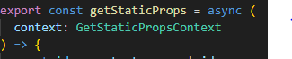

+ SSG 방식 사용 선언
    + getServerSideProps -> getStaticProps로 변경

+ 매개변수 타입 변경
    + GetStaticPropsContext

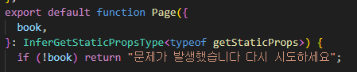

+ 페이지 컴포넌트 매개변수 타입변경
    + InferGetStaticPropsType
    + 제네릭 변경 getStaticProps

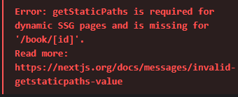

페이지 새로고침시 에러가 발생한다 

에러메세지를 확인해보면 

다이나믹 페이지에서 getStaticPaths 라는 함수가 필요합니다 

라는 에러가 출력된다

동적경로에는 id 속성이 있다 

이뜻은 아이디의 값에 따라서 여러개의 페이지를 렌더링 할 수 있다는 말과 같다

넥스트 서버에서 빌드타임에 SSG 방식으로 사전 렌더링하여 미리 생성해 두기 위해서는 

어떤 url파라미터들이 존재할 수 있는지 어떤 경로들이 존재할 수 있는지 설정하는 과정이 필요하다

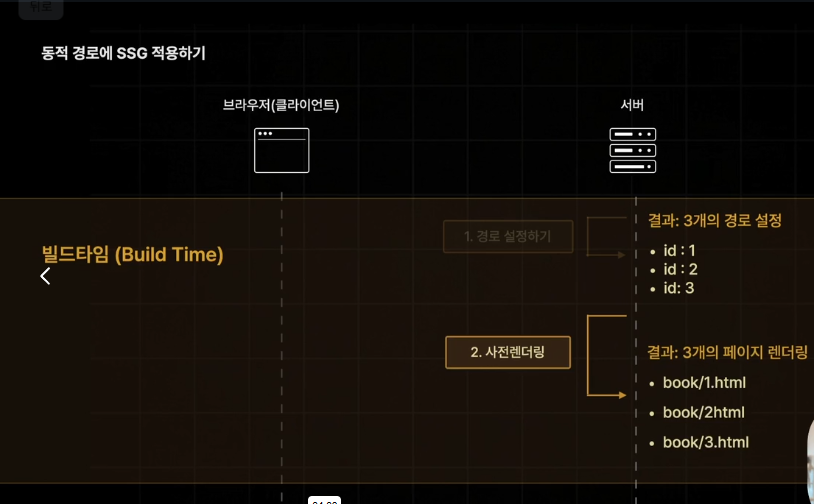

경로설정을 해주게 되면 페이지를 사전렌더링 한다

요청이 들어오게 되면 미리 만들어진 페이지를 반환한다

경로를 설정하는 함수가 getStaticPaths이다 

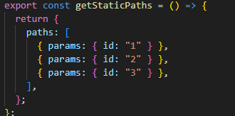

함수를 선언하고 "객체"를 리턴해야한다 

리턴하는 객체안에 paths라는 배열내의 객체로

url 파라미터를 뜻하는 params 의 {id: "1"}
이런식으로 id값의 문자열을 넣어 작성한다

URL 파라미터로 id  값이 1,2,3 이 들어올수 있다는 거고

book/1
book/2
book/3 이라는 페이지가 존재할 수 있다 라고 설정한다

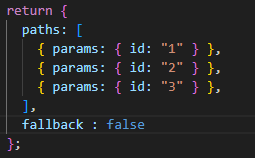

fallback 옵션은 대비책이다 

만일 book/4와 같이 paths에 경로 설정하지 않은 페이지로 요청을 보낼시 어떻게 할건지 대비하는 설정이다 

fallback 의 옵션은 총3가지가 있다

1. false :404 not found 반환
2. blocking : SSR 방식으로 사전렌더링즉시 생성 

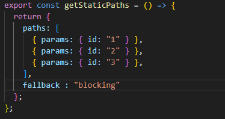

빌드 후에 다시 npm run start로 실행해보면

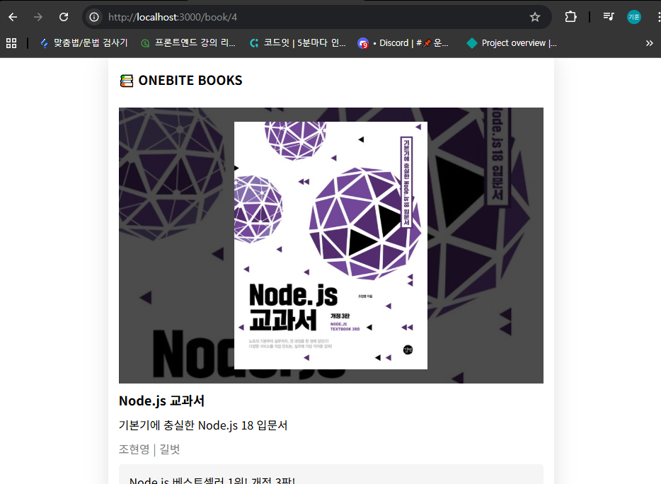

분명 paths 옵션으로 설정하지 않은 경로 임에도 잘 생성되어 보여주고 있다

blocking 옵션을 통해 만들어진 페이지는 빌드타임에 생성해둔 페이지와 비슷하게 넥스트서버에 자동으로 저장이된다

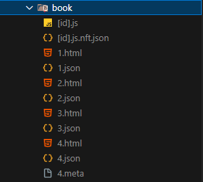

파일 탐색기에 4.html이라는 새로운 페이지가 만들어져 있는걸 확인해볼 수 있다

사전 렌더링 페이지의 용량이 커시간이 길어지는 경우 3. 으로 이동

3. true :데이터가 없는 상태 페이지부터 반환 데이터는 후속으로 반환

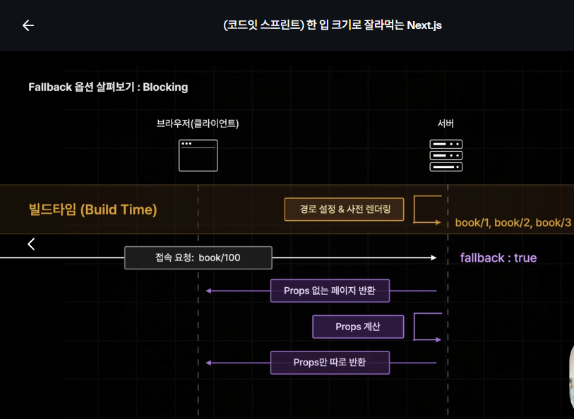

ui 를 먼저 렌더링 하고 데이터는 나중에 전송한다 라고 이해하자

개발자 모드 종료후 빌드를 실행하면

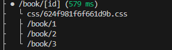

+ book/[id]
    하단에  paths 옵션으로 설정한 페이지들이 사전 렌더링이 된걸 확인할 수 있다 

파일 탐색기에서도 확인 가능

.next ->server -> pages ->book 

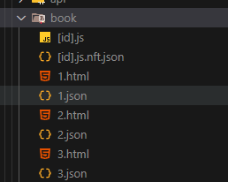

이런식으로 사전에 html파일이 완성되어 있다 

id 값을 넣어서 요청을 보내게 되면 html 파일을 바로 보내주게 되어서 굉장히 빠른속도를 얻을 수 있다

