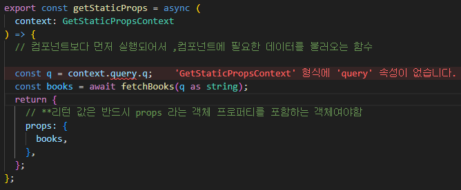
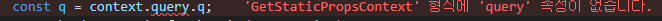
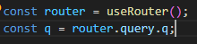
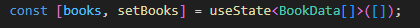
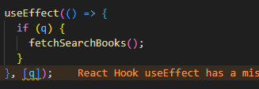

함수 이름 getStaticProps로 설정

SSG 방식 사용을 의미

getStaticProps함수에게 전달되는 context 매개변수에는 query 프로퍼티가 존재하지 않음

이유는??

getStaticProps함수는 빌드타임에 딱 한번 실행이 됨

빌드 타임에 쿼리스트링을 알 수 가 없음

현재 쿼리 스트링을 꺼내와서 해당값을 기준으로 검색결과 데이터를 불러오는 과정을 

사전렌더링 이후에 페이지 역할을 하는 Page 컴포넌트에서 직접 진행하는 방식으로 작성

useRouter 객체에서 쿼리 스트링을 가져오게 작성

데이터를 보관할 useState를 설정 
타입을 BookData의 array로 설정하여 

배열로 반환하게 설정

useEffect 로 활용하여 클라이언트 측에서 백엔드 서버에게 데이터를 직접요청 

