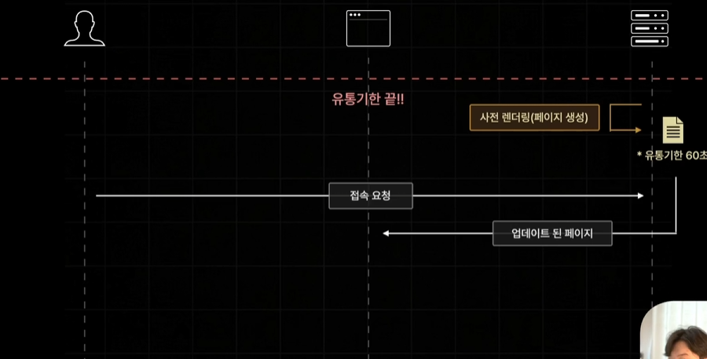
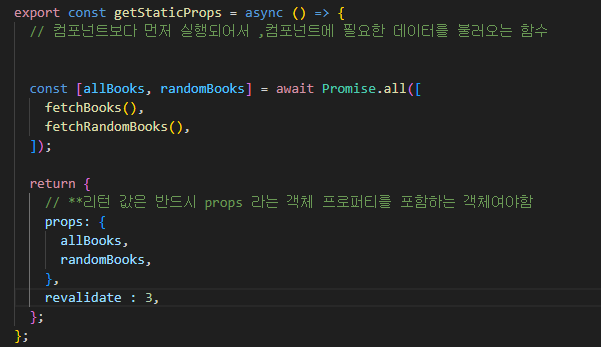

# ISR

SSG 방식으로 생성된 정적 페이지를 일정 시간을 주기로 다시 생성하는 기술

SSG 방식으로 설정한 페이지는 빌드타임에 미리 정적으로 생성한다 

빌드 타임 이후로는 재생성x

페이지를 추후에 요청하더라도 매번 원래만들어두었었던 똑같은 페이지만 반환된다 

속도는 빠름 최신데이터 반영은 많이 어렵다 

일정 시간이 지나 발생하는 접속 요청부터 업데이트된 새로운 페이지를 반환 할수 있도록 설정하는 방식이 ISR 방식

## ISR 설정 방법

렌더링 방식을 정의한 함수 return 문 안에 

revalidate 프로퍼티를 추가 

: 뒤에 유통기한 시간을 설정한다 

인덱스 페이지를 3초 주기로 재검증한다 로 설정할 수 있다

프로젝트를 빌드하고 다시 npm run start를 실시한다 

인덱스 페이지를 새로고침 해보면 
3초주기로 인덱스 페이지의 내용이 업데이트 되어서 변경되는것을 볼 수 있다