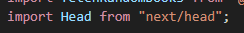
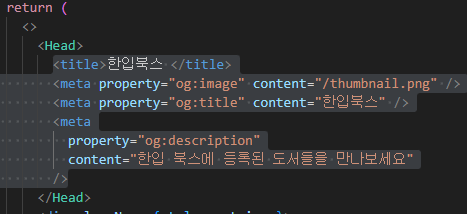
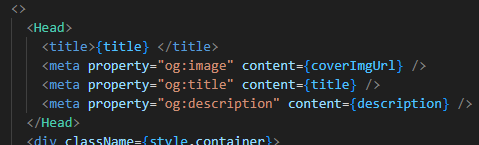
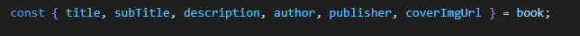
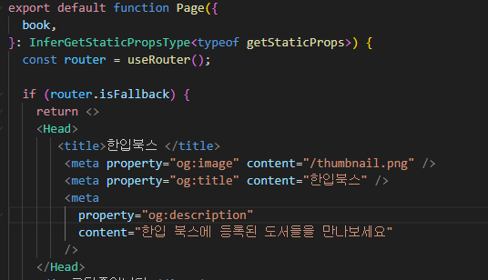

SEO 설정

검색엔진최적화 설정

Head 태그 활용하기 

Head 태그를 next/head로 부터 불러온다

return 문안에 활용하기

빈태그를 만들어 최상위 태그로 활용

Head 태그를 활용하여  
내부에 meta 태그를 삽입한다 

meta 태그를 셀프 닫힘으로 만들고 

프로퍼티와 콘텐츠를 추가한다 

오픈그래프 =og

### 동적경로 페이지에 SEO설정

앞서 했던 방법처럼 빈태그를 최상위 태그로 사용하고 

Head 컴포넌트를 불러와서 활용한다 

이때 다른 페이지와 다른점은 

url 쿼리 스트링의 id 값에 따라 내용이 변하는 페이지이기에

book 데이터로부터 타이틀 이미지 설명을 받아온다 

### SSG 방식 페이지 Fallback true 일떄 

Fallback이 true 라면 

데이터가 없는 페이지를 먼저 반환하고 추후 데이터 로딩이 끝났을때 다시 업데이트된 페이지를 반환한다 

그렇기에 해당 페이지를 처음 요청했을떄 메타 태그가 적용되지 않게 된다 

그렇기에 Fallback 상태에 있을때도 기본적인 meta태그들을 추가를 해야한다
