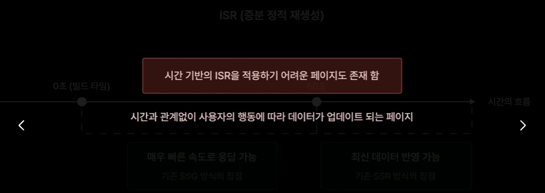
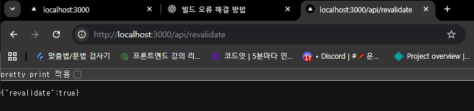

# 주문형 재검증

시간기반으로 작동되는 ISR이 적용되기 어려운 페이지는 다음과 같다 

요청을 받을때마다 페이지를 다시 생성하는 ISR 방식이다

Revalidate 요청을 처리할 새로운 API 라우츠를 만든다 

API 라우츠 핸들러 설정

매개변수로 req,res 를 각각 
NextApiRequest,NextApiResponse 로 타입으로 전달 

handler 에서 index 페이지를 요청 받을시 revalidate를 재생성 시켜주는 코드로 작성

await res 객체에 revalidate 함수 호출

인수로 revalidate 실행할 페이지의 경로를 넣어준다 

    return res.json({ revalidate: true });
index 페이지의 재생성이 잘 완료가 되었다 라고 응답을 한다

API의 revalidate 주소로 접속 요청을 하게 되면 해당 핸들러가 실행 된다 

프로젝트를 다시 빌드 하고 npm run start를 실행

새로운탭에서 핸들러를 작성한 
경로로 요청을 보내게 되면 

revalidate가 잘 동작하였다 라는 메세지가 뜨고 

다시 index 페이지로 돌아가 새로고침을 하게 되면 

페이지의 데이터가 업데이트 되어서 출력되는걸 확인할 수 있다 
