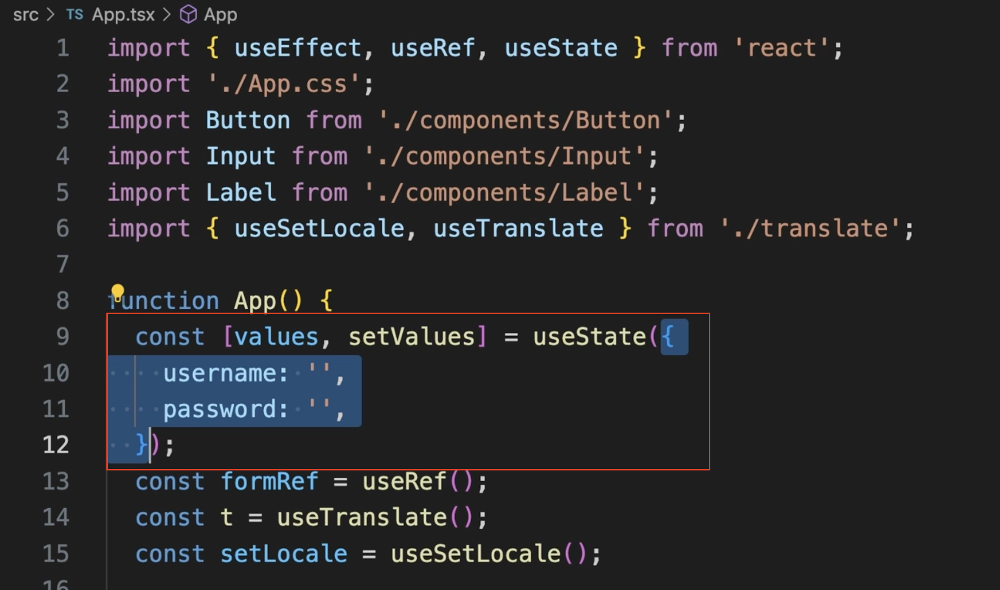

# React Hook 타입 지정하기

## useState

 

기본값을 기준으로 타입 추론이 자동으로 이루어 진다 

현재 예제 코드에서는 useState 기본값으로 객체 ({}) 가 들어가 있어 

그 타입을 기반으로 추론이 되는 모습이다

타입을 명시적으로 정하기 

```
function App () {
    const [value , setValue] = useState<{
        username:string;
        password:string;
    }>({
        username:'',
        password:''
    });
}
```
### useState 뒤에 <> 제네릭문법을 사용하여 타입을 지정한다 

보통은 추론이 잘되서 제네닉으로 지정할 필요는 없지만 

### 예외


```
const [names, setNames] = useState( [] )  // const names: nevr[]
```
빈배열( [] ) 을 초기값으로 주는 경우에는 nevr[] 로 추론이 되기때문에 명시적으로 타입을 지정 해줄 필요가 있다 

```
const [names, setNames] = useState<string[]>( [] )  // const names: string[]
```

