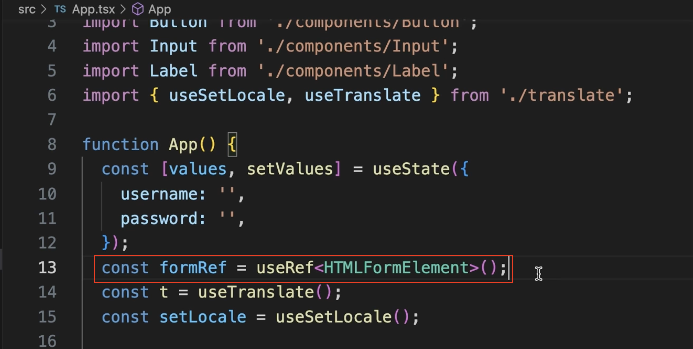
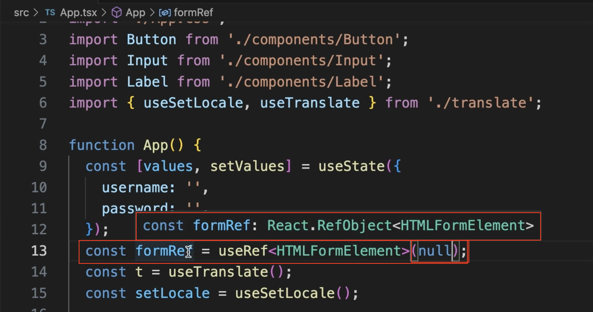

# useRef 타입 지정하기 

+ useRef 사용시  HTML DOM 노드의 타입 -> 제네릭으로 지정
+ 예제에서는 form 노드를 쓰기 때문에 HTMLFormElement를 사용한다 

제네릭으로 타입을 지정했다 

### 중요!

useRef의 기본값으로 null 을 지정해야한다 

formRef 타입을 보면 MutableRefObject<HTMLFormElement | undefined>가 된다.

HTMLFormElement | null이 아닌 상태니까 오류가 나는 것이다.

useRef는 

+ 제네릭으로 Dom 노드 타입 지정

+ 초기값은 null -> 정확한 타입 추론

+ 오류없이 사용가능