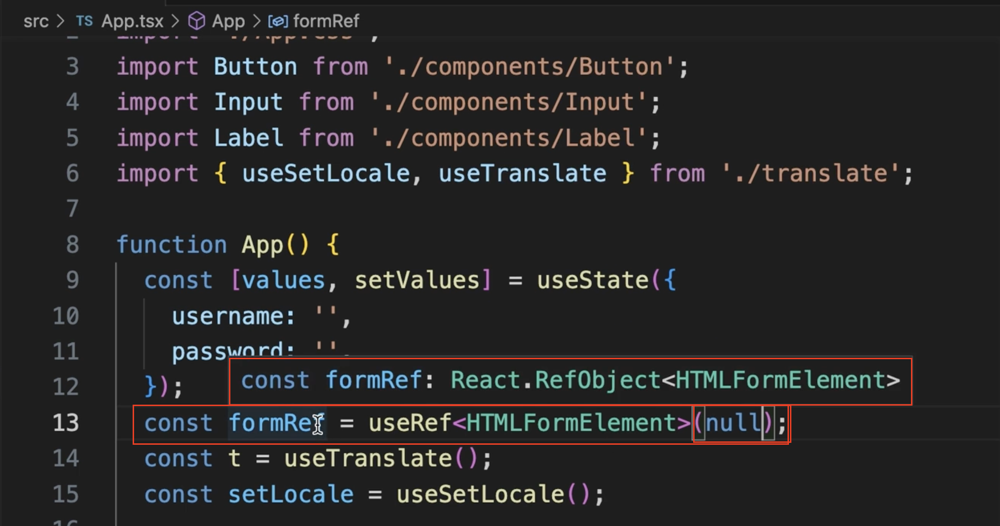

# 컴포넌트 타입 정하기 


Button 컴포넌트는 className을 받고 나머지 Props를 그대로 내려주고 있다

기본적인 Props 타입을 정하는 방법을 배워보자 

+ 필요한 Props만 받도록 형태를 바꾸기


App 컴포넌트에서 Button 컴포넌트는 id,onClick 텍스트를 사용하는 children Prop 이 사용되고 있다.

## Button 컴포넌트 타입 정하기 

컴포넌트의 Props 타입을 지정해보자 

+ 컴포넌트 = 함수 

+ 함수 파라미터의 타입을 지정하는 방법을 사용한다

 

Props = 객체 

interface 로 타입을 정의 한다 

```
interface Props {}
```

먼저 Props 이름의 interface 를 만들어주고

```
interface Props {
    className:string;
    id: string;
    children: ReactNode;
    onClick: any;
}

```

각 Props 의 타입을 지정해준다 

## 여기서 반드시 알고 가야하는 것은 리엑트 에서는 children 의 타입은 보통 ReactNode 이다

만약 Props 중에 선택사항이 있는 Props 가 있다면??

```
interface Props {
    className?:string;
    id?: string;
    children?: ReactNode;
    onClick: any;
}
```

 특정 Props 에  "?" 를 붙여서  옵셔널로 설정한다 

 onClick 의 타입 이벤트 타입이지만 뒤에서 배웠을떄 적용 해보겠다 

### 타입 지정하기

```
export default function Button({ className = '', ...rest }: Props ) {
  const classNames = `${styles.button} ${className}`;
  return <button className={classNames} {...rest} />;
}
```

앞서 interface로 정의한 이름으로 타입을 지정해주면 완료이다 

# input 컴포넌트 타입 정하기 


input 의 기본속성을 다양하게 활용중인 걸 볼 수 있다 

이부분을 일일히 지정하는것은 코드가 너무 길어질 가능성이 있다 (매우 귀찮ㄹㅇ)

이떄 사용하는 것은 리액트가 제공하는 Proptype 을 사용하면 된다 


interface를 선언할때 InputHTMLAttributes 라는 제네릭 타입을 상속받는다 

해당 타입은 input 태그에 적용할수 있는 HTML 속성 타입을 전부 가지고 있다 

```
intrface Props extends InputHTMLAttributes<HTMLInputElement>
```

InputHTMLAttributes 타입의 제네릭파라미터 (<>)  안에 해당하는 속성을 넣는다


rest에 마우스를 호버 해보면

HTML 속성들이 잘 출력되는걸 볼 수 있다 

### 결과

HTML 기본 태그의 속성을 전부 가져올 수 있다 

+ HTMLAttributes 로 끝나는 타입을 상속

+ 제네릭 사용 HTML DOM 노드 타입을 넣어준다