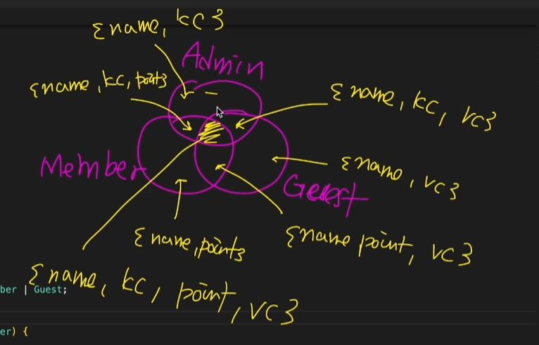

# 서로소 유니온 타입

1. 기본 개념
서로소 유니온 타입이란 교집합이 없는 타입들로만 구성된 유니온 타입(Union Type)을 말합니다. 이는 타입스크립트에서 특정 프로퍼티(태그, Discriminant)를 이용해 유니온 타입을 좁히는(Narrowing) 기법을 의미합니다.

+ 수학적 정의: 두 집합 사이에 공통 원소가 하나도 없을 때, 이 두 집합은 서로소(Disjoint) 관계에 있다고 합니다. (string | number와 같이 원시 타입에서는 교집합이 없는 유니온이 형성됩니다.)

+ 객체 타입에서의 활용: 객체 타입의 유니온에서, 각 타입이 서로를 구분할 수 있는 고유한 리터럴 타입 프로퍼티를 가질 때 서로소 유니온 관계가 성립됩니다.

2. 코드 예시: 태그를 이용한 타입 좁히기
다음은 tag 프로퍼티를 **식별자(Discriminant)**로 사용하여 각 객체 타입이 서로를 구별할 수 있게 만든 예시입니다.
```
TypeScript

type Admin = {
  tag: "Admin"; // ⬅️ 고유한 리터럴 타입
  name: string;
  kickcount: number;
};

type Member = {
  tag: "Member"; // ⬅️ 고유한 리터럴 타입
  name: string;
  point: number;
};

type Guest = {
  tag: "Guest"; // ⬅️ 고유한 리터럴 타입
  name: string;
  visitCount: number;
};

type User = Admin | Member | Guest;

function login(user: User) {
  // 'user.tag'를 통한 타입 좁히기 (Type Narrowing)
  switch (user.tag) {
    case "Admin": {
      // 이 블록 안에서 user는 Admin 타입으로 완벽하게 추론됩니다.
      console.log(`${user.name}님 현재까지 ${user.kickcount}명 강퇴했습니다.`);
      break;
    }
    case "Member": {
      // 이 블록 안에서 user는 Member 타입으로 완벽하게 추론됩니다.
      console.log(`${user.name}님 현재까지 ${user.point} 모았습니다.`);
      break;
    }
    case "Guest": {
      // 이 블록 안에서 user는 Guest 타입으로 완벽하게 추론됩니다.
      console.log(`${user.name}님 현재까지 ${user.visitCount}번 오셨습니다.`);
      break;
    }
  }
}
```
3. 집합 관점의 분석 (핵심 원리)
+  tag 프로퍼티가 사용되기 전



+ tag 프로퍼티를 사용한 후


구조화된 타입 정의:

+ Admin, Member, Guest 세 타입은 모두 name과 tag 프로퍼티를 공유하지만, tag 프로퍼티의 값이 각각 "Admin", "Member", "Guest"라는 고유한 문자열 리터럴 타입으로 지정되어 있습니다.

서로소 관계 형성:

+ 이 고유한 리터럴 타입 덕분에 세 타입 간에는 tag 프로퍼티를 기준으로 교집합이 존재하지 않는 완벽한 서로소 관계가 형성됩니다.

타입 좁히기 (Discrimination):

+ switch (user.tag) 구문을 사용하면, TypeScript 컴파일러는 각 case 블록 내에서 user가 어떤 유니온 타입인지 정확하게 구분(Discriminate)하여 타입을 좁혀줍니다.

+ 예를 들어, case "Admin"에서는 user가 반드시 Admin 타입임을 알게 되어 안전하게 kickcount 프로퍼티에 접근할 수 있습니다.

### 핵심 용어 정리: 
+ 이처럼 고유한 리터럴 프로퍼티를 사용하여 유니온 타입을 좁히는 기법을 TypeScript에서는 **Discriminated Union (구별된 유니온)**이라고 합니다.


