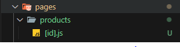
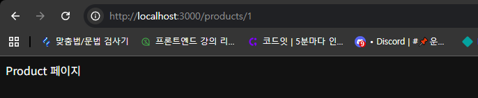
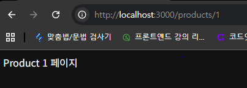
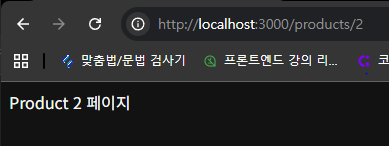

# 파일 시스템 기반 라우팅

+ 파일의 경로가 주소에 매칭되는 라우팅 방식

html 처럼 폴더를 만들고 js 파일을 만든다음 

export default 로 컴포넌트를 내보내면 

```
export default function Search() {
    return <div>Search 페이지</div>
}
```

그것이 페이지가 됨

다이나믹 라우팅

파일이름에 "[]" 를 쓰고 param 의 이름을 적어주면 된다




```
export default function Product() {
    return <div>Product 페이지</div>
}
```



쿼리스트링을 이용해서 페이지를 이동하면 위에 결과가 나오게 된다 

link 컴포넌트 

페이지 전체를 불러오는게 아닌 필요한 데이터만 불러온다
이를 최적화라고 함

브라우저 환경이 느릴때 쓰면 좋다

```
import styles from '@/styles/Home.module.css';
import Link from 'next/link';

export default function Home() {
  return (
    <div>
      <h1>Codeitmall</h1>
      <ul>
        <li>
          <Link href="/products/1">첫 번째 상품</Link>
        </li>
        <li>
          <Link href="/products/2">두 번째 상품</Link>
        </li>
        <li>
          <Link href="/products/3">세 번째 상품</Link>
        </li>
        <li>
          <Link href="https://codeit.kr">코드잇</Link>
        </li>
      </ul>
    </div>
  );
}

```

useRouter 

```
import { useRouter } from "next/router"
```

useRouter를 import 하고

```
const router =useRouter();
    const {id} = router.query
```

useRouter 객체를 생성한다
router 객체의 .query 값으로 {id} 를 가져오게 작성한다 

```
return <div>Product {id} 페이지</div>
```

return 문에서 변수로 id 값을 가져오게 작성하여 화면에 보여주게 한다




.../products/{id}

id 값이 바뀔때마다 페이지의 내용이 다르게 출력 되는걸 볼 수 있다 

다른예시 
```
import SearchForm from "@/compo/SearchForm";
import { useRouter } from "next/router";

export default function Search() {
  const router = useRouter();
  const { q } = router.query;

  return (
    <div>
      <h1>Search 페이지</h1>
      <SearchForm initialValue={q}/>
      <h2>{q} 검색 결과</h2>
    </div>
  );
}
```

이번에는 useRouter객체에서 쿼리 값으로  {q}
값을 가져온다 

return문에 h2 태그에서 볼 수 있듯이 

```
<h2>{q} 검색 결과</h2>
```
주소창의 q 값에 따라서 다른 페이지를 보여주고 내용도 다르게 만들 수 있다


### useRouter 페이지 이동하기 

```
SearchForm.js

export default function SearchForm(initialValue = "") {
  const router = useRouter();
}

```

useRouter 객체를 만들고 

```
export default function SearchForm(initialValue = "") {
  const router = useRouter();
  const [value, setValue] = useState(initialValue);
}
```

useState() 로 value의 상태변화를 다룰수 있게 작성

```
  function handleChange(e) {
    setValue(e.target.value);
  }

  function handleSubmit(e) {
    e.preventDefault();
    if (!value) {
      router.push("/");
      return;
    }
    router.push(`/search?q=${value}`);
  }

  return (
    <form onSubmit={handleSubmit}>
      <input name="q" value={value} onChange={handleChange} />
      <button>검색</button>
    </form>
  );
```

form 태그에서 검색 버튼을 누르면 handleSubmit 함수가 실행된다 

```
function handleSubmit(e) {
    e.preventDefault();
    if (!value) {
      router.push("/");
      return;
    }
    router.push(`/search?q=${value}`);
  }
```

handleSubmit 함수는 event 객체를 인수로 받고

value의 값이 없다면 "최상위페이지"로 

value의 값이 있다면 /search?q=${value}

value 값이 들어간 페이지를 리턴한다 


.push 인수로 받은 주소값으로 페이지를 이동시킨다 


# Api 연동하기


정리

##Link 컴포넌트
Next.js에서는 링크를 연결하는데 a 태그 대신에 Link 컴포넌트를 사용합니다. a 태그를 사용하면 페이지를 이동할 때 페이지 전체를 다시 로딩하기 때문에 속도가 느리고, 빈 화면이 잠깐 보이면서 깜빡거림이 생기지만, Link 컴포넌트는 Next.js에서 내부적으로 여러 가지 최적화를 해주기 때문에 빠르고 부드러운 페이지 전환이 가능합니다.
```
import Link from 'next/link';
```
```
export default Page() {
  return **<Link; href="/">홈페이지로 이동/**Link/>;
}
```
## useRouter() Hook
쿼리 사용하기
router.query 값을 사용하면 페이지 주소에서 Params 값이나 쿼리스트링 값을 참조할 수 있습니다.

예를 들면 pages/products/[id].js 페이지에서 router.query['id'] 값으로 Params id에 해당하는 값을 가져올 수 있었습니다.
```
pages/products/[id].js
```

```
import { useRouter } from 'next/router';

export default function Product() {
  const router = useRouter();
  const id = router.query['id'];

  return <>Product #{id} 페이지</>;
}
/search?q=티셔츠와 같은 주소로 들어왔을 때 router.query['q'] 값으로 쿼리스트링 q에 해당하는 값을 가져올 수 있었습니다.

pages/search.js

import { useRouter } from 'next/router';

export default function Search() {
  const router = useRouter();
  const q = router.query['q'];

  return <>{q} 검색 결과</>;
}
```
## 페이지 이동하기
router.push() 함수를 사용하면 코드로 페이지를 이동할 수 있었습니다.
```
import { useState } from 'react';
import { useRouter } from 'next/router';

export default function SearchForm() {
  const [value, setValue] = useState();
  const router = useRouter();

  function handleChange(e) {
    setValue(e.target.value);
  }

  function handleSubmit(e) {
    e.preventDefault();
    if (!value) {
      return router.push('/');
    }
    return router.push(`/search?q=${value}`);
  }

  return (
    <form onSubmit={handleSubmit}>
      <input name="q" value={value} onChange={handleChange} />
      <button>검색</button>
    </form>
  );
}
```
리다이렉트

next.config.js 파일을 수정하면 특정 주소에 대해서 리다이렉트할 주소를 지정할 수 있습니다. 예를 들어서 /products/:id라는 주소로 들어오면 /items/:id라는 주소로 이동시켜 줄 수 있었죠.

이때 permanent라는 속성으로 상태 코드를 정할 수 있었는데요. permanent: false로 하면 307 Temporary Redirect를 하고, permanent: true로 하면 브라우저에 리다이렉트 정보를 저장하는 308 Permanent Redirect를 할 수 있었습니다.

```
/** @type {import('next').NextConfig} */
const nextConfig = {
  async redirects() {
    return [
      {
        source: '/products/:id',
        destination: '/items/:id',
        permanent: true,
      },
    ];
  },
}


module.exports = nextConfig;
```
## 커스텀 404 페이지
존재하지 않는 주소로 들어올 경우에 Next.js에서는 기본적으로 404 페이지를 보여 줍니다. 내가 원하는 404 페이지를 보여주려면 pages/404.js 파일을 만들고 일반적인 페이지처럼 구현하면 됩니다.

## 커스텀 App
모든 페이지에 공통적으로 코드를 적용하고 싶다면 커스텀 App 컴포넌트를 수정하면 됩니다. pages/_app.js 파일에 있는 컴포넌트인데요. 이 컴포넌트에 사이트 전체에서 보여 줄 컴포넌트나 전체적으로 적용할 리액트 컨텍스트를 적용할 수 있었습니다. 그리고 사이트 전체에 적용할 CSS 파일도 여기서 임포트할 수 있죠.

커스텀 App 컴포넌트의 Props는 Component와 pageProps가 있는데요. 우리가 만든 페이지들이 Component Prop으로 전달되고 여기에 내부적으로 필요한 Props는 pageProps라는 값으로 전달됩니다.
```
pages/_app.js
```
```
import Header from '@/components/Header';
import { ThemeProvider } from '@/lib/ThemeContext';
import '@/styles/globals.css';

export default function App({ Component, pageProps }) {
  return (
    <ThemeProvider>
      <Header />
      <Component {...pageProps} />
    </ThemeProvider>
  );
}
```

## 커스텀 Document
pages/_document.js 파일에 있는 Document 컴포넌트는 HTML 코드의 뼈대를 수정하는 용도로 사용합니다. 코드는 React 컴포넌트이지만 일반적인 컴포넌트처럼 동작하지는 않기 때문에 useState나 useEffect처럼 브라우저에서 실행이 필요한 기능들은 사용할 수 없습니다.
```
 pages/_document.js 
```

```
import { Html, Head, Main, NextScript } from 'next/document'

export default function Document() {
  return (
    <Html lang="ko">
      <Head />
      <body>
        <Main />
        <NextScript />
      </body>
    </Html>
  )
}
```