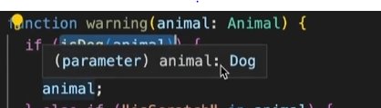
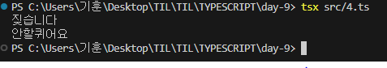

# 사용자 정의 타입가드

## 예제

```
type Dog = {
  name: string;
  isBark: boolean;
};

type Cat = {
  name: string;
  isScratch: boolean;
};

type Animal = Dog | Cat;

function warning(animal: Animal) {
  if ("isBark" in animal) {
    console.log(animal.isBark ? "짖습니다" : "안짖어요");
  } else if ("isScratch" in animal) {
    console.log(animal.isScratch ? "할큅니다" : "안할퀴어요");
  }
}
```

+ 타입 Dog ,Cat 을 정의하고 

+ 두 타입의 유니온 타입인 Animal 타입 정의

+ 매개변수로 Animal 타입의 값을 받아 동물에 따라 다른경고를 콘솔에 출력하는 warning 함수 선언

## 하지만

+ in 연산자를 이용하면 타입이 좁혀지지않는다
+ Dog 타입의 프로퍼티가 중간에 이름이 수정되거나 삭제될 경우 타입가드가 동작하지 않을 수도 있다  

### 커스텀 타입가드 만들기

```
(...)

// Dog 타입인지 확인하는 타입 가드
function isDog(animal: Animal): animal is Dog {
  return (animal as Dog).isBark !== undefined;
}

// Cat 타입인지 확인하는 타입가드
function isCat(animal: Animal): animal is Cat {
  return (animal as Cat).isScratch !== undefined;
}

function warning(animal: Animal) {
  if (isDog(animal)) {
    console.log(animal.isBark ? "짖습니다" : "안짖어요");
  } else {
    console.log(animal.isScratch ? "할큅니다" : "안할퀴어요");
  }
}
```

```
function isDog(animal: Animal): animal is Dog {
  return (animal as Dog).isBark !== undefined;
}
```

타입 가드로 사용할 함수를 선언


```
if (isDog(animal)) {
    console.log(animal.isBark ? "짖습니다" : "안짖어요");
    }
```

if 문에 조건부를 타입가드 함수로 넣어준다

이제 animal 변수의 타입을 확인해보면



타입이 잘 좁혀지고 

```
// 테스트용 데이터
const dog: Dog = { name: "뽀삐", isBark: true };
const cat: Cat = { name: "나비", isScratch: false };

// 함수 호출
warning(dog); // 뽀삐: 짖습니다
warning(cat); // 나비: 안할퀴어요
```

테스트 데이터를 넣고 출력을 해보면

